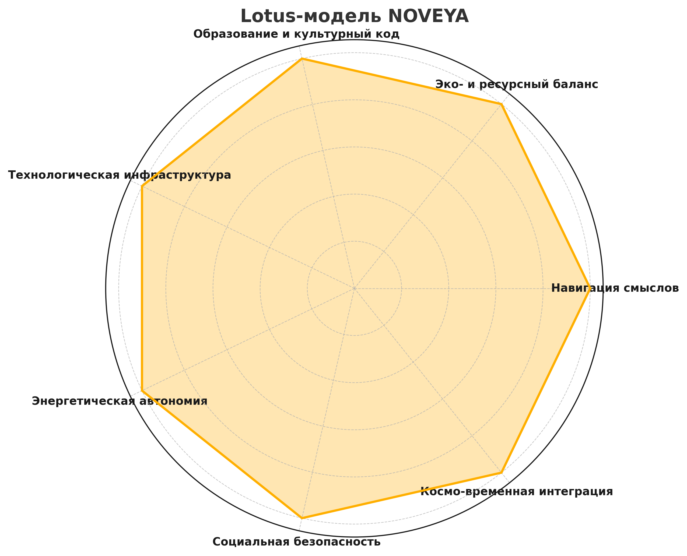

# 🌐 NOVEYA Meta-Platform

## 1. Манифест
NOVEYA — это распределённая мета-платформа для самоорганизации, суверенного взаимодействия и создания живых сообществ.  
Мы объединяем формально-диалектическую логику (FDL), смысловую оболочку СВЕТ и технологические узлы в единую экосистему.  

Наши принципы:
- Созидательная сопричастность
- Резонансное управление
- Световая динамика
- Системное равновесие

---

## 2. Архитектура ядра

```ascii
[Google Colab] <--код и эксперименты--> [GitHub] <--хранилище и API-->
       ↓
   [FDL Compiler] ←→ [FDL Token Engine] ←→ [Geochron Navigator]
       ↓
     [SVET Shell] ←→ [Lexicon Guard] ←→ [FDL Interface Protocol]
       ↓
 [Пользователи и Громады] ↔ [Discord / Notion / Локальные узлы]
```

**Компоненты:**
- **FDL Compiler** — преобразование FDL-языка в исполняемую структуру.
- **FDL Token Engine** — учёт и оценка действий в единицах смысловой эффективности.
- **Geochron Navigator** — временно-пространственная навигация событий.
- **SVET Shell** — согласование действий через смысловую фильтрацию.
- **Lexicon Guard** — защита инфополя от подмен и манипуляций.

---

## 3. Модули репозитория

| Файл | Назначение |
|------|------------|
| `protonovea_core.py` | Логическое ядро NOVEYA |
| `svet_shell.py` | Оболочка СВЕТ |
| `fdl_compiler.py` | Компилятор FDL |
| `FDLToken.py` | Токенизация действий |
| `fdl_geochron_navigator.py` | Геохрон-навигация |
| `FDLInterfaceProtocol.py` | Связь FDL и внешних систем |
| `fdl_lexicon_guard.py` | Лексико-смысловая защита |
| `memory.json` | Базовая конфигурация памяти |

---

## 4. Подключение участников

1. Получите доступ к Google Colab и GitHub-репозиторию.
2. Клонируйте репозиторий:
   ```bash
   git clone https://github.com/<ORG>/noveya-meta-platform.git
   ```
3. Запустите демо-ноутбук `NOVEYA_Demo.ipynb`.
4. Пройдите через инструкцию FDL-запросов.
5. Подключитесь к Discord для координации.

---

## 5. Lotus-модель NOVEYA



- Навигация смыслов
- Эко- и ресурсный баланс
- Образование и культурный код
- Технологическая инфраструктура
- Энергетическая автономия
- Социальная безопасность
- Космо-временная интеграция

---

https://github.com/NgoiSigma/NOVEYA-Meta-Platform/discussions

---

**Лицензия:** FDL-OpenKnowledge  
**Версия:** v1.0.0  
